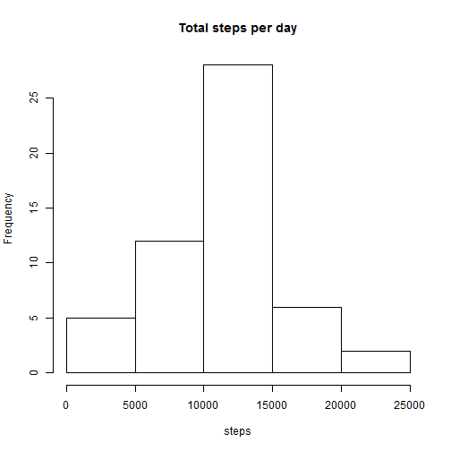
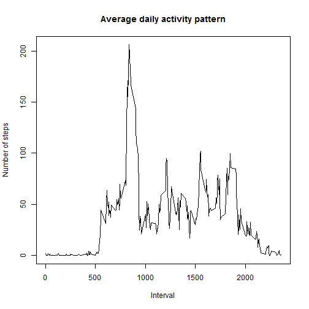
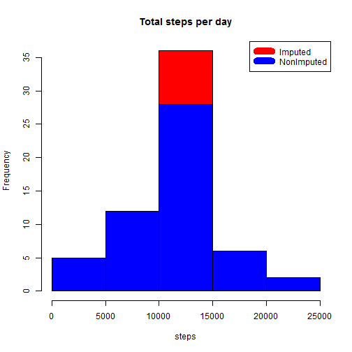
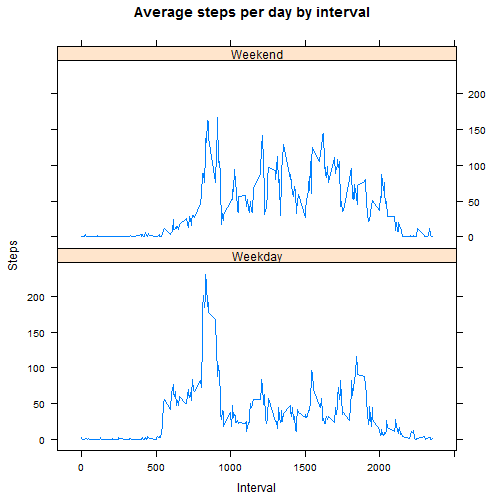

## About

This is the first project for the Reproducible research. The purpose of this assignment is to analyse the data from "Fitbit" by answering specific questions

## Data

The data for this assignment can be downloaded from the course web site:

- Dataset: Activity monitoring data [52K]

The variables included in this dataset are:

- steps: Number of steps taking in a 5-minute interval (missing values are coded as NA)
- date: The date on which the measurement was taken in YYYY-MM-DD format
- interval: Identifier for the 5-minute interval in which measurement was taken

## Reading and cleaning the data


```r
activity <- read.csv("activity.csv")
activity$day <- weekdays(as.Date(activity$date))
activityclean <- activity[!is.na(activity$steps),]
```

## What is mean total number of steps taken per day?

1. Calculate the total number of steps taken per day
2. Calculate the mean and median of the total number of steps taken per day


```r
totalsteps <- aggregate(activityclean$steps ~ activityclean$date, FUN = sum, )
colnames(totalsteps) <- c("Date", "Steps")

hist(totalsteps$Steps, xlab = "steps", main = "Total steps per day")
```



```r
stepsmean <- mean(totalsteps$Steps)
stepsmedian <- median(totalsteps$Steps)

#Mean of the total steps
stepsmean
```

```
## [1] 10766.19
```

```r
#Median of the total steps
stepsmedian
```

```
## [1] 10765
```

## What is the average daily activity pattern?

1. Plot the nbumber of steps on interval
2. Calculate the maximum interval


```r
intervalsteps <- aggregate(activityclean$steps ~ activityclean$interval, FUN = mean, )
colnames(intervalsteps) <- c("Interval", "Steps")

plot(intervalsteps$Interval, intervalsteps$Steps, type = "l", xlab = "Interval", ylab = "Number of steps", main = "Average daily activity pattern")
```



```r
maxinterval <- intervalsteps[which.max(intervalsteps$Steps),1]
#Maximum Interval
maxinterval
```

```
## [1] 835
```

## Impute missing values. Compare imputed to non-imputed data

1. Calculate and report the total number of missing values in the dataset


```r
nrow(activity[is.na(activity$steps),])
```

```
## [1] 2304
```

2. Fill in the missing values
3. Create a new dataset that is equal to the original dataset but with the missing data filled in


```r
#NA values are filled with the corresponding values from the interval dataset
imputeddata <- transform(activity, steps = ifelse(is.na(activity$steps), intervalsteps$Steps[match(activity$interval, intervalsteps$Interval)], activity$steps))
```

4. Plot the histogram of the imputed data


```r
totalstepsim <- aggregate(imputeddata$steps ~ imputeddata$date, FUN = sum)
colnames(totalstepsim) <- c("Date", "Steps")
hist(totalstepsim$Steps, xlab = "steps", main = "Total steps per day", col = "red")
hist(totalsteps$Steps, xlab = "steps", main = "Total steps per day", col = "blue", add = T)
legend("topright", c("Imputed","NonImputed"), col = c("Red","Blue"), lwd = 10)
```



5. Difference between the imputed and original data 


```r
#calculating the difference between the mean and median after imputing
meandiff <- mean(totalstepsim$Steps) - mean(totalsteps$Steps)
mediandiff <-  median(totalstepsim$Steps) - median(totalsteps$Steps)
#Difference between mean
meandiff
```

```
## [1] 0
```

```r
#Differnece between median
mediandiff
```

```
## [1] 1.188679
```

## Are there differences in activity patterns between weekdays and weekends

1. Create a new factor variable in the dataset with two levels - "weekday" and "weekend" indicating whether a given date is a weekday or weekend day.
2. Plot the   data


```r
weekdays <- c("Monday", "Tuesday", "Wednesday", "Thursday", "Friday")
imputeddata$fact <- as.factor(ifelse(is.element(imputeddata$day, weekdays), "Weekday", "Weekend"))
intervalstepsim <- aggregate(imputeddata$steps ~ imputeddata$interval + imputeddata$fact, FUN = mean)
colnames(intervalstepsim) <- c("Interval", "Fact", "Steps")
library(lattice)
```

```
## Warning: package 'lattice' was built under R version 3.3.2
```

```r
xyplot(intervalstepsim$Steps ~ intervalstepsim$Interval|intervalstepsim$Fact, xlab = "Interval", ylab = "Steps", main = "Average steps per day by interval", type = "l", layout = c(1,2))
```


